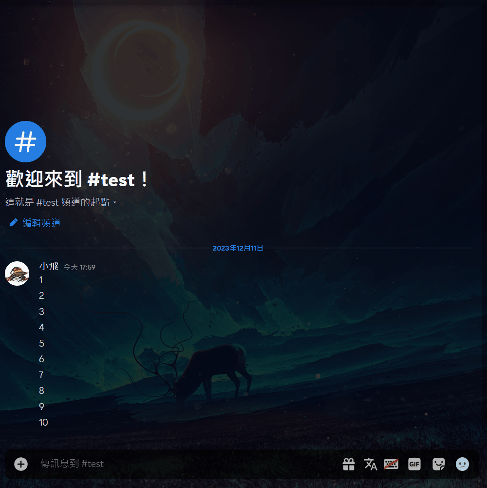

# OA_Bot

**_Discord Bot_**

🇯🇵 日本語のドキュメントはこちら → [README_JP.md](README_JP.md)  
🇨🇳 中文說明文件 → [README.md](README.md)

This is a multi-purpose Discord bot developed mainly in a Chinese environment.

---

## 目錄

- [專案概要](#專案概要)
- [安裝與啟動方式](#安裝與啟動方式)
- [主要功能](#主要功能)

---

## [邀請機器人進入伺服器](https://discord.com/api/oauth2/authorize?client_id=799467265010565120&permissions=2147575872&scope=bot)

---

## 專案概要

此專案是一個將 Discord 常用功能整合在一起的 Bot，包含隨機選擇、訊息管理、投票、娛樂功能與音樂播放等。  
Designed to simplify common Discord server operations by providing frequently used features in a single bot.

---

## 安裝與啟動方式

### 1. 複製專案

```bash
git clone https://github.com/vaz1306011/OA_Bot
cd OA_Bot
```

### 2. 設定 Bot Token

將 `.env.example` 複製或重新命名為 `.env`。

```bash
cp .env.example .env
```

接著打開 `.env`，將裡面的 Token 改成自己的 Discord Bot Token。

### 3. 設定管理者 ID

將 `data/data.json.example` 複製或重新命名為 `data/data.json`。

```bash
cp data/data.json.example data/data.json
```

接著打開 `data/data.json`，將 `owner_ids` 欄位填入自己的 Discord 使用者 ID。

### 4. 啟動 Bot

前景執行：

```bash
docker compose up --build
```

背景執行：

```bash
docker compose up --build -d
```

---

## 主要功能

### 播放音樂


---

### 隨機選擇


---

### 清理之後的訊息



---

### 開啟/關閉 關鍵字檢測功能

    /omi guild <status>
    /omi channel <status>
    /omi user <status>

---

### 查詢成員、身分組、頻道、伺服器等 id

    /id guild
    /id role <role>
    /id channel <channel>
    /id member [member]

---

### 查詢機器人 ping

    /ping

---

### 新增/刪除身分組

    /role add <member> <role>
    /role remove <member> <role>

---

### 骰骰子

    /roll [min] [max]

---

### 匿名發言

    /say <message>

---

### 投票

    /vote <content>

---

### 猜拳

    /vow [epc] [m1] [m2] [m3] [m4] [m5] [m6] [m7] [m8] [m9] [m10]

---

To be continued...
